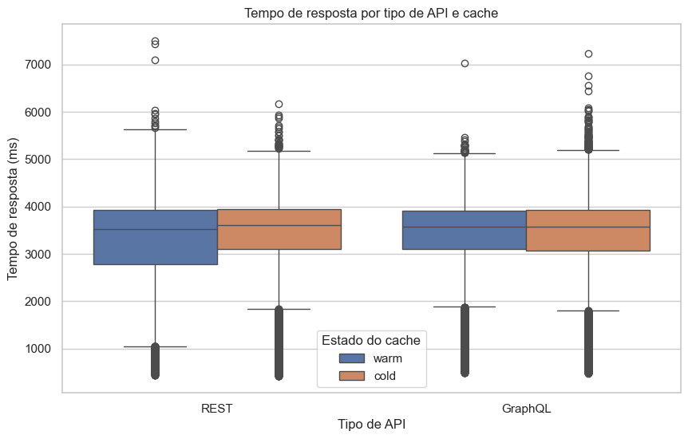
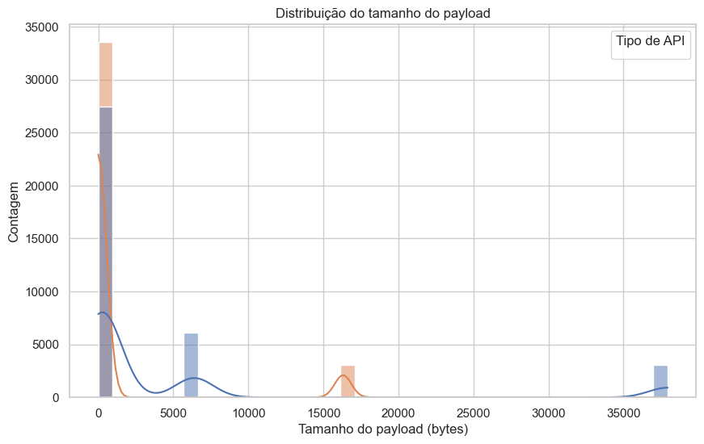
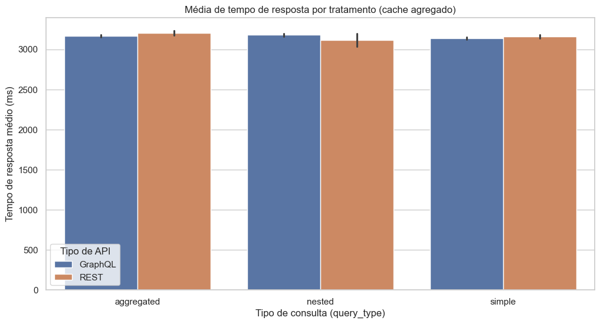

# Análise dos Resultados — GraphQL vs REST

## Estatísticas Descritivas
- response_time_ms: {"count": 73200, "mean": 3158.148540122951, "median": 3574.8715, "std": 1198.2931275266496, "p25": 3023.759, "p75": 3925.1445}
- payload_size_bytes: {"count": 73200, "mean": 2904.982049180328, "median": 0.0, "std": 8136.4065145353325, "p25": 0.0, "p75": 495.0}

## RQ1 — Tempos de resposta
- Teste: mannwhitney (stat=669813258.0, p=0.9907173731121247)
- Decisão: Não rejeita H0
- Tamanho de efeito aproximado: 0.030869

## RQ2 — Tamanho de payload
- Teste: mannwhitney (stat=1025132470.0, p=0.0)
- Decisão: Rejeita H0
- Tamanho de efeito aproximado: 0.529312

## Visualizações

